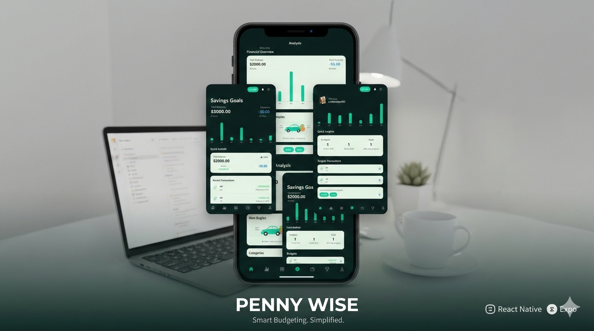

<div align="center">
	
</div>

# Penny Wise

Smart budgeting, simplified. Track transactions, set budgets, manage savings goals, and stay on top of your finances across mobile and web.

## Built by

- Yeabsira Kayel
- Saliha Abdo

## Features

- Secure sign in and password reset
- Transaction tracking with categories
- Budgets with progress insights
- Savings goals with target updates
- Notifications and quick insights
- Analysis dashboard with charts

## Tech Stack

- Expo (React Native)
- Expo Router
- Node.js + Express
- Neon Postgres

## Project Structure

```
backend/   # API server
mobile/    # Expo app
```

## Getting Started

### 1) Backend

Create backend environment variables:

```
DATABASE_URL=your_neon_postgres_url
UPSTASH_REDIS_REST_URL=optional
UPSTASH_REDIS_REST_TOKEN=optional
```

Run the API:

```
cd backend
npm install
npm run dev
```

### 2) Mobile

Create mobile environment variables:

```
EXPO_PUBLIC_CLERK_PUBLISHABLE_KEY=your_clerk_key
EXPO_PUBLIC_API_URL=http://localhost:5001/api
```

Run the app:

```
cd mobile
npm install
npm start
```

## Tests

Backend tests:

```
cd backend
npm test
```

## Notes

- If you are running on a physical device, point `EXPO_PUBLIC_API_URL` to your machine’s IP address.
- Rate limiting is disabled if Upstash env vars are not provided.
